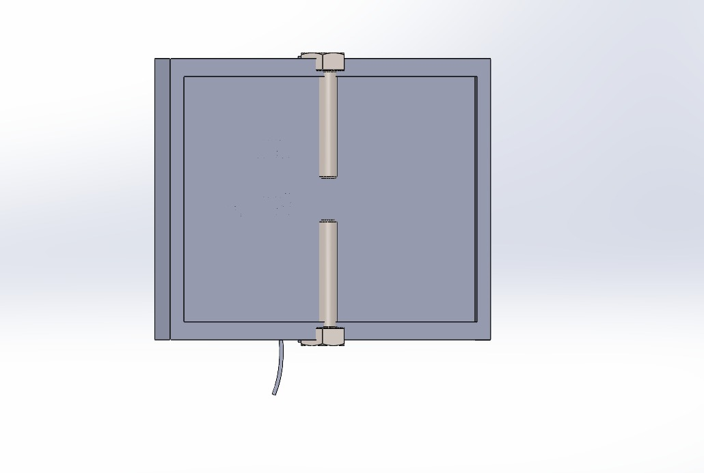
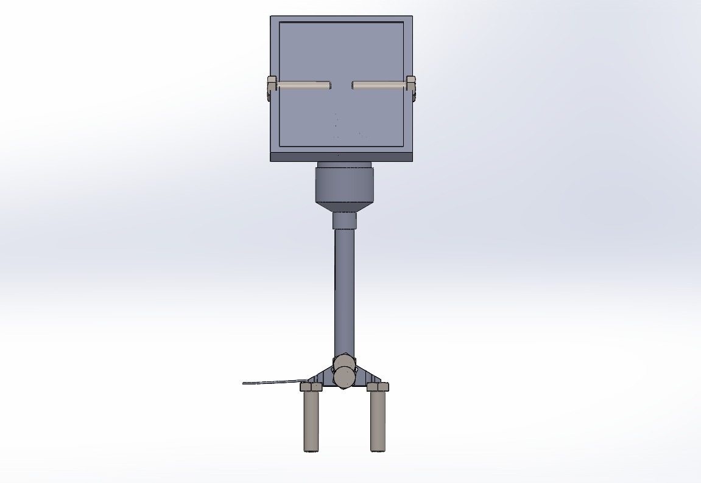
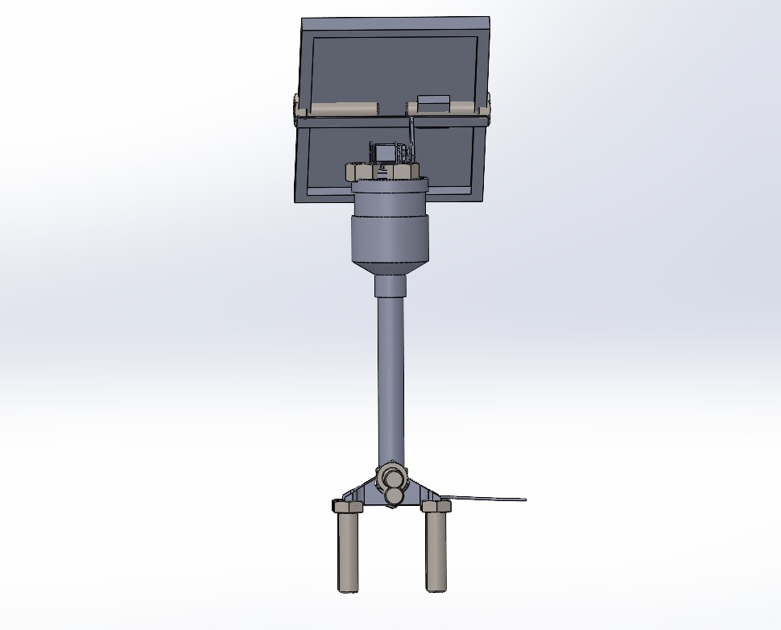
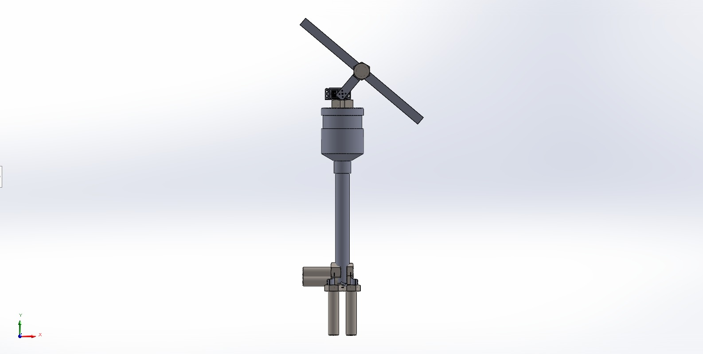
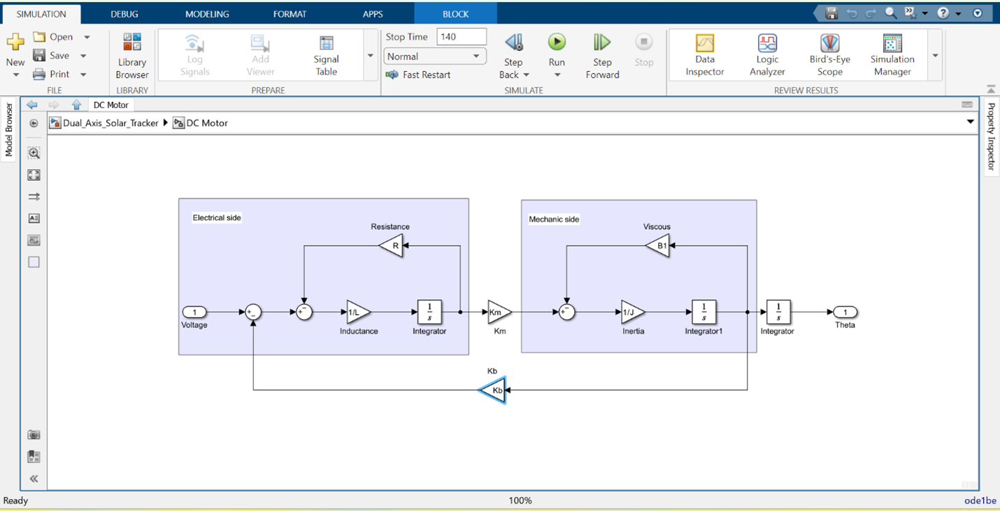
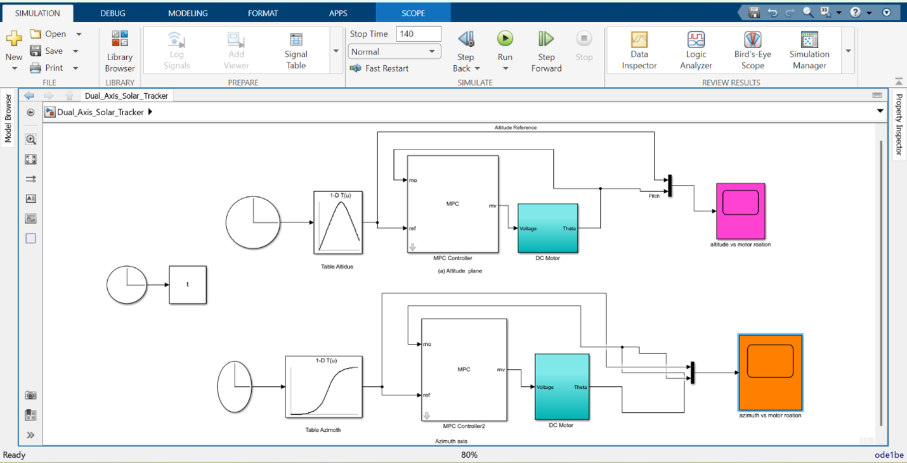
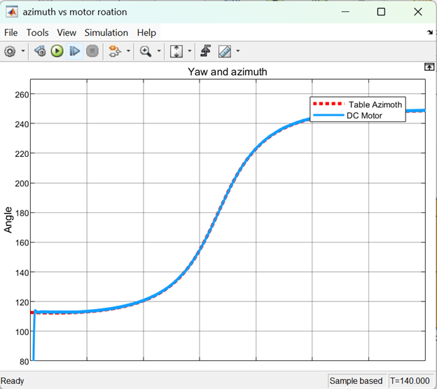
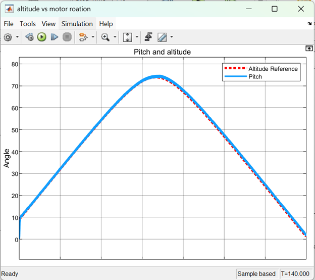

# Dual-Axis-Solar-Tracker-for-Maximum-Power-Generation
This project focuses on the design and simulation of an intelligent dual-axis solar tracking system that continuously aligns a photovoltaic panel with the sun’s position to maximize energy harvesting efficiency. Unlike fixed panels, the system dynamically tracks both azimuth and elevation angles throughout the day.

[📖 Read this on Linkedin](https://www.linkedin.com/posts/dulsika-mendis-53640431a_dual-axis-solar-tracker-for-maximum-power-activity-7414889005542105088-Zp2N?utm_source=social_share_send&utm_medium=member_desktop_web&rcm=ACoAAFDcrfoBfs-t0YrwyHS3fSSOQ8I4PrWgqeQ)

[Click here to view Technical Report](Group_14_Latex_Document)

## 🌞 Project Overview

This repository presents the design and simulation of a **Dual-Axis Solar Tracking System** developed to maximize photovoltaic (PV) power generation by continuously aligning a solar panel with the sun’s position throughout the day.

Unlike conventional fixed-angle solar panels, which suffer from cosine losses as the sun moves, the proposed system dynamically tracks the sun along both **azimuth (horizontal)** and **elevation (vertical)** axes. This ensures that the solar panel remains nearly perpendicular to incoming solar radiation, significantly improving energy harvesting efficiency.

The system is implemented using a **model-based control approach**, where the solar tracker dynamics are modeled and controlled using **Model Predictive Control (MPC)** in the MATLAB/Simulink environment. **Time-based solar position references** are used instead of light sensors, enabling stable and reliable tracking even under cloudy or non-uniform lighting conditions.

This project demonstrates a **low-cost, efficient, and scalable solar tracking concept**, suitable for educational laboratories, small-scale solar installations, and renewable energy research applications.

## 🧩 System Architecture

The dual-axis solar tracking system consists of two independently controlled rotational axes: **azimuth (horizontal)** and **elevation (vertical)**. Each axis is driven by a DC motor and controlled through a **Model Predictive Control (MPC)** strategy implemented in **MATLAB/Simulink**.

The system operates using **time-based solar position reference signals**, eliminating the dependency on light sensors. Reference angles for both axes are generated based on the apparent movement of the sun and are continuously compared with the actual motor positions in a **closed-loop configuration**. The MPC controller computes optimal control inputs while considering system dynamics and actuator constraints, ensuring **smooth, stable, and accurate tracking**.

  

  <b>Figure 1:</b> System process flow of the dual-axis solar tracking system

## 🔧 Hardware Components

Although this project is simulation-based, the system is designed with practical hardware implementation in mind. The main hardware components include:

- **Photovoltaic (PV) Panel** – Energy generation unit mounted on a dual-axis structure  
- **DC Motors (2 units)** – Independent actuation for azimuth and elevation axes  
- **Motor Drivers (H-Bridge)** – Interface between controller and motors  
- **Microcontroller / Embedded Controller** – Intended for real-time control execution  
- **Mechanical Mounting Structure** – Dual-axis frame designed using SolidWorks  
- **Power Supply Unit** – Provides regulated power to motors and control electronics  

The mechanical design ensures **stability, smooth rotation, and accurate alignment** of the solar panel.

  <table>
    <tr>
      <td align="center">
         
        (a) Top View
      </td>
      <td align="center">
         
        (b) Front View
      </td>
    </tr>
    <tr>
      <td align="center">
         
        (c) Back View
      </td>
      <td align="center">
         
        (d) Side View
      </td>
    </tr>
  </table>

  <b>Figure 2:</b> Dual Axis Solar Tracking System (SolidWorks)

## 🧪 Methodology and Simulation

### System Modeling
- DC motor dynamics were modeled using electrical and mechanical equations.
- System parameters such as resistance, inertia, torque constant, and friction were incorporated.

  

  

  <b>Figure 3:</b> DC Motor Electrical–Mechanical Subsystem

### Reference Generation
- Time-based solar position reference signals for azimuth and elevation were generated using lookup tables.
  
  You can see predefine data and Simulink model through below link. 
  [Click here to view the MATLAB files](DUAL_AXIS_SOLAR_TRACKER-Matlab)

### Control Strategy
- Model Predictive Control (MPC) was implemented to track reference angles.
- Control constraints were applied to prevent excessive actuator effort.

### Simulation Environment
- MATLAB/Simulink was used for modeling, control implementation, and validation.
- Closed-loop simulations were performed to evaluate tracking performance.

    

  

  <b>Figure 4:</b> Overall Dual-Axis Simulink Model

### Performance Evaluation
- Tracking accuracy, control smoothness, and system stability were analyzed through simulation results.

## 📊 Key Results

- Accurate tracking of both azimuth and elevation reference angles
- Minimal steady-state error and smooth transient response
- Stable system behavior under constrained control inputs
- Reduced unnecessary motor actuation compared to sensor-based trackers
- Demonstrated potential energy gain of 30–40% compared to fixed-angle solar panels (based on literature comparison)
- The results validate the effectiveness of MPC for dual-axis solar tracking applications

  The simulation results demonstrate that the proposed MPC-based control strategy is capable of accurately tracking the desired reference angles for both azimuth and elevation axes. The motor responses closely follow the reference trajectories with minimal steady-state error and smooth transient behavior, indicating effective predictive control and stable closed-loop operation.

  

<table>
  <tr>
    <td align="center">
       
      <b>Azimuth reference and motor tracking response</b>
    </td>
    <td align="center">
       
      <b>Elevation (pitch) reference and motor tracking response</b>
    </td>
  </tr>
</table>

  <b>Figure 5:</b> Reference Tracking Performance

  ## 🚀 Future Works

- Hardware implementation of the proposed control system
- Real-time embedded controller deployment (e.g., Arduino / STM32 / ESP32)
- Hybrid sensor fusion, combining time-based tracking with irradiance sensors
- Energy yield comparison with fixed and single-axis systems
- Weather-adaptive control strategies for dynamic environmental conditions
- Optimization for large-scale or off-grid solar installations

  ## Authors and Acknowledgments

**Authors:**  
- T.A.S.D. Mendis (University of Moratuwa)  
- M.R.L.S. Maththegama  (University of Moratuwa)  
-  M.A.A.A. Muhamath (University of Moratuwa)  
  
**Acknowledgments:**  
We would like to express our sincere gratitude to the Department of Electrical Engineering at the University of Moratuwa for providing the resources, guidance, and support required for the successful completion of the module **EE-3204: Engineering System Designs**.

