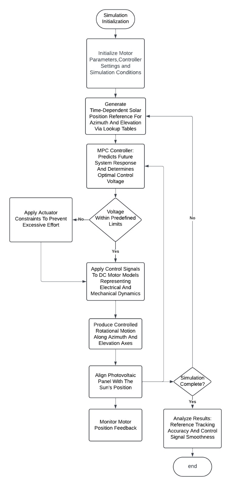

# Dual-Axis-Solar-Tracker-for-Maximum-Power-Generation
This project focuses on the design and simulation of an intelligent dual-axis solar tracking system that continuously aligns a photovoltaic panel with the sun’s position to maximize energy harvesting efficiency. Unlike fixed panels, the system dynamically tracks both azimuth and elevation angles throughout the day.

## 🌞 Project Overview

This repository presents the design and simulation of a **Dual-Axis Solar Tracking System** developed to maximize photovoltaic (PV) power generation by continuously aligning a solar panel with the sun’s position throughout the day.

Unlike conventional fixed-angle solar panels, which suffer from cosine losses as the sun moves, the proposed system dynamically tracks the sun along both **azimuth (horizontal)** and **elevation (vertical)** axes. This ensures that the solar panel remains nearly perpendicular to incoming solar radiation, significantly improving energy harvesting efficiency.

The system is implemented using a **model-based control approach**, where the solar tracker dynamics are modeled and controlled using **Model Predictive Control (MPC)** in the MATLAB/Simulink environment. **Time-based solar position references** are used instead of light sensors, enabling stable and reliable tracking even under cloudy or non-uniform lighting conditions.

This project demonstrates a **low-cost, efficient, and scalable solar tracking concept**, suitable for educational laboratories, small-scale solar installations, and renewable energy research applications.

## 🧩 System Architecture

The dual-axis solar tracking system consists of two independently controlled rotational axes: **azimuth (horizontal)** and **elevation (vertical)**. Each axis is driven by a DC motor and controlled through a **Model Predictive Control (MPC)** strategy implemented in **MATLAB/Simulink**.

The system operates using **time-based solar position reference signals**, eliminating the dependency on light sensors. Reference angles for both axes are generated based on the apparent movement of the sun and are continuously compared with the actual motor positions in a **closed-loop configuration**. The MPC controller computes optimal control inputs while considering system dynamics and actuator constraints, ensuring **smooth, stable, and accurate tracking**.

  

  <b>Figure 1:</b> System process flow of the dual-axis solar tracking system

